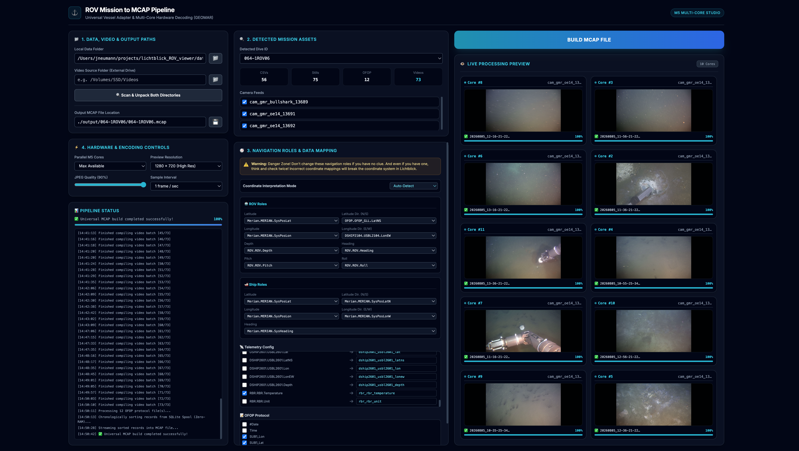
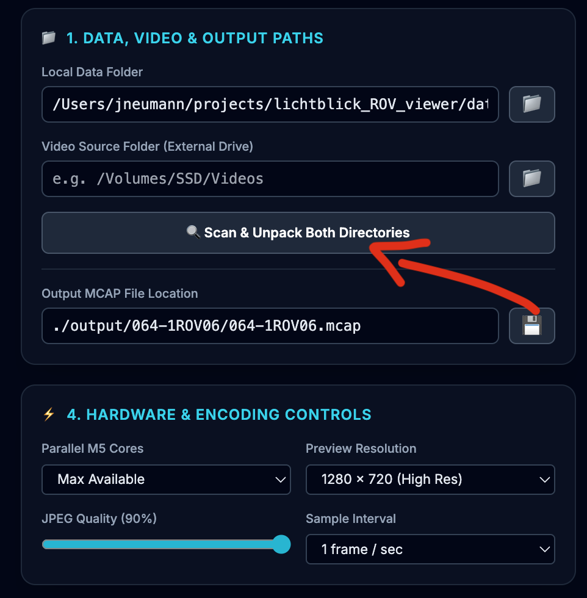
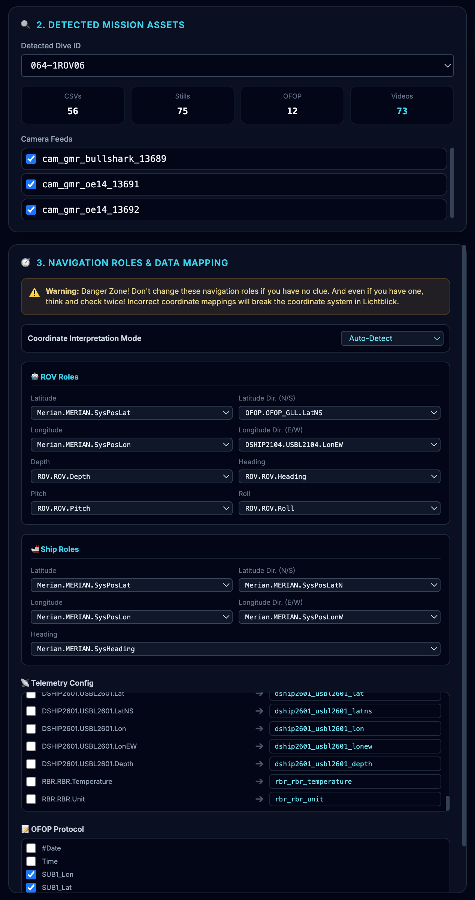
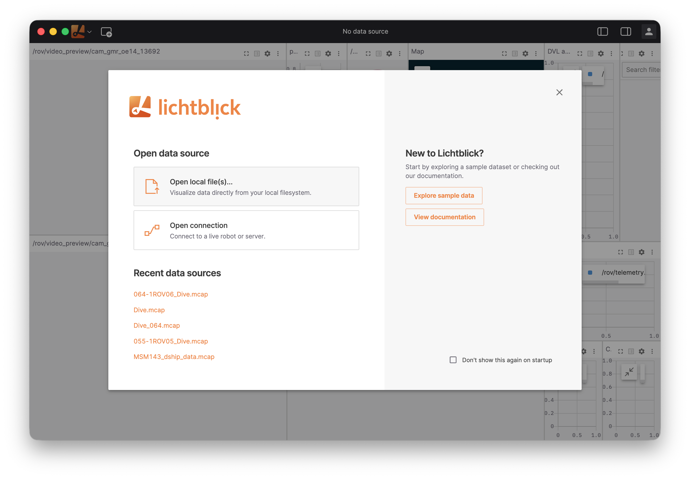
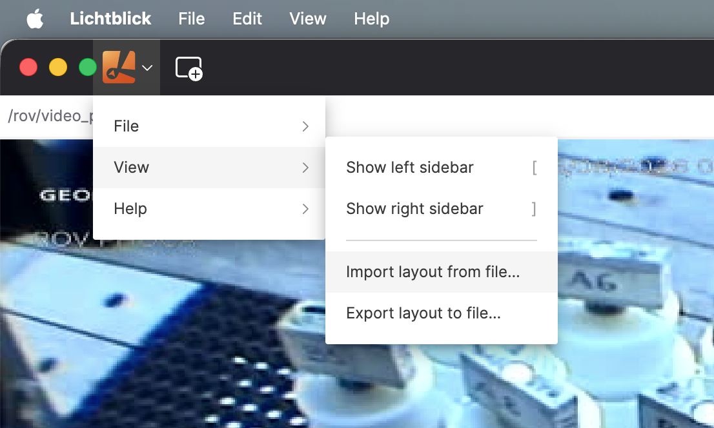

# ROV MCAP Pipeline & [Lichtblick](https://lichtblick-suite.github.io/lichtblick/) Viewer Guide

**Developed at [GEOMAR Helmholtz Centre for Ocean Research Kiel](https://www.geomar.de/) by [Jan Neumann](https://www.linkedin.com/in/neumi)**

_If in doubt, ask!_

### Why this is relevant
ROV missions generate a massive, chaotic web of multimodal data scattered across different storage architectures and file formats. A single dive typically produces:
 - **ROV Telemetry & Technical Data:** Vehicle states, navigational sensors, and winch/tether loads.
 - **Scientific Payloads:** CTD casts, temperature probes, and OFOP protocols. 
 - **Media Streams:** Multiple parallel video feeds and still images.
 - **DSHIP Surface Vessel Data:** Ship positioning, movement, and weather conditions.
  
**The Challenge:** Post-dive analysis usually requires to manually cross-reference these fragmented files, making it tedious to review mission events. 

**The Solution:** [Lichtblick](https://github.com/lichtblick-suite/lichtblick) is a powerful, user-friendly visualization suite designed to solve this. It provides an interface that allows you to scrub through hours of synchronized video, maps, and time-series sensor data in minutes. 

**However**, [Lichtblick](https://github.com/lichtblick-suite/lichtblick) requires all of this data to be packaged in the unified **[MCAP](https://mcap.dev/) file** format. 

**Where this tool fits in:** The ROV Lichtblick Pipeline acts as the bridge between raw mission exports and post-dive visualization. It automatically reads, synchronizes, and compiles the diverse data generated by **GEOMAR ROV systems** into a single, high-performance MCAP file, making your data ready for analysis. 

The tool renders +700GB of video and telemetry logs into a relatively small (a few GB) MCAP file in ~20 minutes on an M5 MacBook Pro using all hardware acceleration I could find.

This pipeline automatically takes care of timing, parsing different data formats (OFOP, video formats, telemetry data), and packs everything into a time-synced **MCAP** format for later review in Lichtblick. 🫥🔚♾️🔝🔜🔙🔛➿🕰️🫯




> **⚠️ Note on Hardware:**
> 
> This pipeline is optimized for **Apple Silicon** architecture, using the hardware-accelerated VideoToolbox decoding, zero-RAM SQLite spooling, and an I/O monitor to prevent external drive thrashing. If you are using an external SSD, make sure to use a **VERY** fast connection method. Do not try running this on a standard office PC. It will take several days to finish. External hard drives work, but keep in mind the read/write speed might be the primary bottleneck for the transformation process (though highly recommended if you deal with TBs of data).

> **⚠️ Note on Data Storage & Drive Speeds**
> A standard ROV dive lasts several hours and can easily generate over a terabyte (TB) of data. Because this pipeline processes multiple high-resolution video streams in parallel, performance is heavily bottlenecked by your hard drive's read speed.
> **The Ideal Setup:** Running the conversion directly from an internal NVMe SSD is multiple times faster.
> **The Practical Setup:** Since storing terabytes of data internally isn't always feasible, I recommend loading your video files onto a fast external Thunderbolt/USB 4 SSD before starting the conversion.
> **What to Avoid:** Don't run this pipeline directly from a network drive (NAS) or a mechanical spinning backup drive (HDD). The I/O latency will cripple the extraction process and turn a 20-minute job into a multi-day ordeal.


## Part 1: Generating the MCAP File

### 🚀 Key Features

-   **Split Data Source:** Read heavy video files (`.mov`/`.mp4`) directly from an external SSD while reading metadata/CSVs from a local machine, keeping the final output perfectly time-synced.
    
-   **In-Memory FFmpeg Pipes:** Bypasses disk-write bottlenecks by piping hardware-decoded C-level `ffmpeg` frames directly into Python's active memory with multi-core useage.
    
-   **Auto-Tune I/O Governor (Experimental):** Automatically monitors external USB bus latency. If the drive begins to choke, worker cores yield their bandwidth instantly, surfing the edge of maximum physical drive speeds without crashing.
    
-   **Zero-RAM SQLite Spooling:** Eliminates out-of-memory crashes by dumping base64 video payloads into an embedded SQLite database on the fly, sorting millions of frames in milliseconds before packing the MCAP.
    
-   **Live Dashboard:** A Flask/Tailwind web interface that provides a real-time visual grid of every active CPU core and the video frames they are currently processing.
    

### 🛠️ Prerequisites & Installation

To run this pipeline from scratch, you will need an Apple Silicon Mac (like M5), a terminal and Python installed.

**1. Install FFmpeg (Crucial for Hardware Acceleration)**

The script uses FFmpeg's `videotoolbox` to decode video quickly. Install it via Homebrew:

```bash
brew install ffmpeg
```

**2. Set Up the Python Environment**

Clone the repository and create a clean virtual environment:

```bash
# Clone the repository
git clone https://github.com/neumi/ROV_MCAP_pipeline.git
cd ROV_MCAP_pipeline

# Create a virtual environment
python3 -m venv .venv

# Activate the virtual environment
source .venv/bin/activate
```

**3. Install Required Dependencies**

Install the required Python packages:

```bash
pip install Flask mcap opencv-python
```

_(Note: OpenCV is included as a fallback decoder in case FFmpeg is missing from the system path. But it's a lot slower!)_

### 📁 Expected Folder Structure

The pipeline uses regular expressions to auto-detect dive IDs (e.g., `064-1ROV06`). It actively scans through lower-layered folders, so it is not critical to select the exact dive folder. You can select the overarching mission folder and filter your target dive in the MCAP pipeline UI later. Video files that are chucked, will be merged by the software. Timestamps need to line up. Data storage formats are usually defined by logging software, OFOP etc. and are provided by the [ROV team](https://www.geomar.de/st/rovphoca/rov-team).

It expects your data to follow this rough hierarchy (though it is very tolerant):

```plaintext
📂 MSM145_Data (Local or External)
 ┣ 📂 064-1ROV06
 ┃ ┣ 📜 metadata.xml (Dive metadata)
 ┃ ┣ 📂 Telemetry
 ┃ ┃ ┣ 📜 2026-08-05_Merian_MSM145_064-1ROV06_Telemetry.zip  <-- (Auto-extracted)
 ┃ ┃ ┗ 📜 ..._TLS.csv
 ┃ ┣ 📂 DigiStills
 ┃ ┃ ┣ 📜 2026-08-05_12-30-00.jpg
 ┃ ┃ ┣ 📜 2026-08-05_12-30-01.jpg
 ┃ ┃ ┗ 📜 2026-08-05_12-30-02.jpg
 ┃ ┣ 📂 Protocols
 ┃ ┃ ┗ 📜 2026-08-05_..._ofop_protocol.csv
 ┃ ┣ 📂 cam_gmr_bullshark_13689
 ┃ ┃ ┣ 📜 20260805_12-30-00.mov
 ┃ ┃ ┣ 📜 20260805_12-40-00.mov
 ┃ ┃ ┗ 📜 20260805_12-50-00.mov
 ┃ ┗ 📂 cam_gmr_oe14_13691
 ┃   ┣ 📜 20260805_12-30-00.mp4
 ┃   ┣ 📜 20260805_12-40-00.mp4
 ┃   ┗ 📜 20260805_12-50-00.mp4
```

**Important Data Handling Notes:**

-   **Zipped Files:** If your Telemetry or CTD data is zipped, the script will automatically extract them into a temporary `./extracted_data` folder in your project directory so your raw drive remains untouched.
    
-   **Cameras:** Video files must be housed in folders starting with `cam_` (e.g., `cam_gmr_hdlookdown_123`) OR the video files themselves must have `cam_` in their filename. These camera names will automatically become the telemetry topics that Lichtblick reads!
    
-   **Usually** the data you've received from the ROV team should be compatible out of the box and could share the same folder structure like in the example. 🤞


### 💻 Usage Guide

**1. Start the Server**

With your virtual environment activated, run the script:

```bash
python ROV_data_to_MCAP_WEB.py
```

Open your browser and navigate to: **[http://127.0.0.1:5000](http://127.0.0.1:5000)**


**2. Configure Paths & Scan**

1.  **Local Data Folder:** Point this to the root of your expedition data containing the CSVs and Zips.
    
2.  **Video Source Folder:** Point this to your video source folder (could be an external SSD) containing the heavy `.mov`/`.mp4` files. _(Leave blank if videos are in the local data folder)._
    
3.  Click **🔍 Scan & Unpack Both Directories**.
    



**3.1 Detected Mission Assets and Navigation Roles & Data Mapping**

1.  **Chose the ROV dive:** Select the ROV dive you want to convert to MCAP. Check if you see CSVs, Stills, OFOP and Video data! 
2.  **Select the cameras you want to see:** This will influence heavily how long it will process.
3.  **Navigation Roles & Data Mapping** You can customize the data mapping if your project requires different logging data.

> **⚠️ Warning:**
> Modify point 3 with caution. If this mapping is configured incorrectly, Lichtblick will fail to render.
> 
> If you experience rendering issues after making changes, you can easily revert to the standard export settings:
> 1. Download the default [mcap_mapping_config.json.](https://github.com/Neumi/ROV_MCAP_pipeline/blob/main/mcap_mapping_config.json)
> 2. Replace the modified file in your local environment.
> 3. Restart the server.




**4 Set Hardware & Encoding Controls**

Choose your parameters carefully based on your hardware and storage setup (see _Performance Tuning_ below).


### ⚡ Performance Tuning & Optimization

To achieve the fastest possible MCAP build times (e.g., reducing a 20-minute job down to 5 minutes), follow these guidelines:

-   **Sample Interval (The Biggest Impact):**
    
    -   **1 frame / 1 sec:** Standard resolution, but takes the longest to decode.
        
    -   **1 frame / 2 sec:** Cuts processing time by exactly 50%.
        
    -   **1 frame / 5 sec:** Fastest option. Eliminates 80% of video decoding overhead while retaining enough data for timeline scrubbing in Lichtblick.
        
-   **Parallel M5 Cores (I/O Constraints):** Your Mac's M5 CPU is faster than your external hard drive. Setting the core count too high on a slow drive will cause USB bus thrashing.
    
    -   **4 Cores:** Use this if reading videos from a standard mechanical External USB 3.0 HDD.
        
    -   **8 Cores:** The sweet spot for standard External USB-C SSDs.
        
    -   **Max Available:** Only use this if the raw videos are stored on an internal NVMe drive or a high-bandwidth Thunderbolt 4 SSD.
        
-   **The Auto-Tune I/O Choke Tracker:** If you select too many cores, **the system shouldn't crash**. The built-in DIY I/O governor times every read request. If latency spikes > 0.1s, cores will briefly show a `⚠️ I/O Choke` warning and automatically micro-sleep to yield bandwidth, preventing drive failure. At least I hope so. 🤞
    

## Part 2: Viewing the Dive in Lichtblick
Lichtblick is a visualization tool that lets you play back the MCAP files you just generated. Think of it like a highly advanced video player, but instead of just watching a movie, you can see dive maps, synchronized camera feeds, depth charts, and OFOP logs and telemetry data exactly as they were recorded during the ROV deployment.

### Step 1: Open or Install Lichtblick

You have two choices for using Lichtblick: you can run it right in your web browser, or download it to your computer.

-   **Option A: The Web Version (Quickest)** If you just want to take a quick look at a small file:
    
    1.  Open a Chrome based browser.
        
    2.  Go to: **[https://lichtblick-suite.github.io/lichtblick/](https://lichtblick-suite.github.io/lichtblick/)**
        
-   **Option B: The Desktop Version (Recommended)** Because ROV MCAP files are very large, the desktop app performs significantly better.
    
    1.  Go to the download page: **[Lichtblick Releases](https://github.com/lichtblick-suite/lichtblick/releases)**
        
    2.  Scroll down to the **Assets** section of the latest release.
        
    3.  Download the file for your computer (Mac: `.dmg` | Windows: `.exe` | Linux: `.AppImage`).
        
    4.  Install and open it just like any regular app.
        

### Step 2: Open your Dive Data

1.  Open Lichtblick.
    
2.  On the welcome screen, click **Open data source**.
    
3.  Select **Open local file(s)...** from the menu.
    
4.  Browse your computer, select the `.mcap` file you built in Part 1, and click **Open**. _(You can also just drag and drop the `.mcap` file directly into the Lichtblick window)_
    



### Step 3: Load the ROV Layout

When you first open a file, your screen might look blank. A **Layout** is a saved template (`.json` file) that instantly organizes the screen into neat panels, for example, putting the `OE14_13692` video feed on the left, the telemetry chart on the right, and the map somewhere else.

1.  Look at the icons on the far-upper-left edge of the screen (the Topbar).
    
2.  Click on the **Lichtblick Symbol** tab (it looks like a large orange **_L_**).
    
3.  In the menu, click **View -> Import layout from file...** button.
    
4.  Select your standard ROV `.json` layout file.
    
5.  Click on the newly imported layout in the list to apply it. Your screen is ready.
    



### Step 4: Play and Explore!

Now you can control the playback of the dive:

-   **The Timeline:** At the bottom of the screen, you will see a long timeline bar showing the total length of the ROV dive.
    
-   **Scrubbing & Playback:** Click the **Play** button (▶) to watch the data live, or click and drag the timeline slider to jump instantly to specific OFOP events or seafloor observations.
    
-   **Speed:** Change the playback speed (e.g., `0.5x` for slow motion, `5x` for fast forward) using the controls next to the play button.
    
-   **3D Navigation:** In the 3D panel, click and drag to rotate your view around the ROV, and use your mouse wheel to zoom in and out.


_If in doubt, ask!_


## Citation

If you use this in your work or research, please be so kind and cite the project using the details below:

* **ORCID:** [](https://orcid.org/0009-0003-9829-8959) [https://orcid.org/0009-0003-9829-8959](https://orcid.org/0009-0003-9829-8959)

### BibTeX

```bibtex
@misc{open_echo,
  author       = {Jan Neumann},
  title        = {ROV\_MCAP\_pipeline},
  year         = {2026},
  publisher    = {GitHub},
  journal      = {GitHub Repository},
  howpublished = {\url{[https://github.com/neumi/ROV\_MCAP\_pipeline](https://github.com/neumi/ROV\_MCAP\_pipeline)}},
  note         = {ORCID: [https://orcid.org/0009-0003-9829-8959](https://orcid.org/0009-0003-9829-8959)}
}
```
